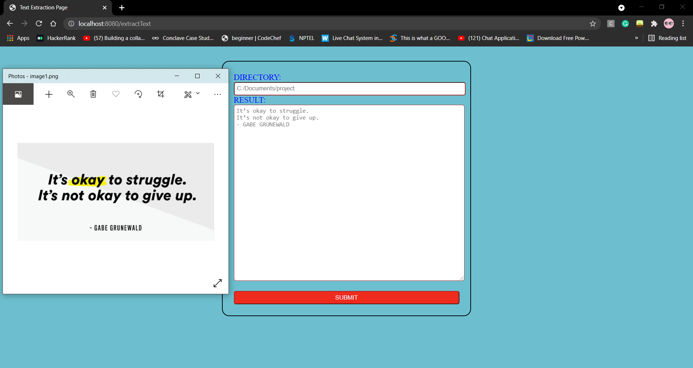

# Smart ID Scanner
> Spring boot application to extract text form images.

## Table of Contents
* [General Info](#general-information)
* [Technologies Used](#technologies-used)
* [Features](#features)
* [Screenshots](#screenshots)
* [Room for Improvement](#room-for-improvement)
* [Acknowledgements](#acknowledgements)

## General Information
- Smart ID Scanner reads an image from the user using image recognition API and fetch the text inside the image and then displays the text.
- If you have text in an image such as a PNG file, its likely either that its a graphic of some sort with some text, or a screenshot, or it may even been and image thats been generated by a scanner. To extract the text from this image or images, we need to have some software that will let us run OCR on the images.
- Optical character recognition(OCR) is a technology that is used to recognise text in images. 
- This project provides optical character recognition(OCR) tool which helps in automatic retrieval of text from an image thus helping us in speeding up the processing and eliminating manual data retrevial to very minimum.

## Technologies Used
- Spring Boot - a web container framework that makes the process of getting up and running with a java application, in particular a web application, much simpler.
- Tesseract - an OCR Engine which is now developed and supported by Google.
- Mysql database

## Features
- Registration page
- Login page
- Error page for invalid credentials
- Text extraction page

## Screenshots

## Room for Improvement
- Dataset for recognizing different languages other than english can be added to make this project more functional.
- Different test cases can run to provide more scope for exception handling.

## Acknowledgements
- This project was inspired by our learnings from the internship.
- This project was based on [this dataset](https://https://github.com/tesseract-ocr/tessdata).
